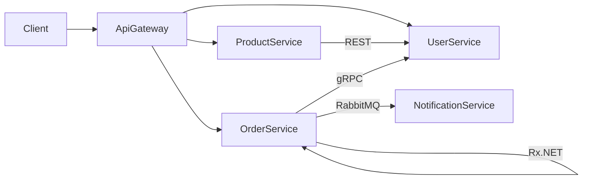

# 🏗️ DevOps Mikroservisni Projekat

## 📌 Opis projekta

Mikroservisna aplikacija razvijena u **.NET 8**, koja demonstrira celokupan DevOps workflow: od razvoja, testiranja, CI/CD pipeline-a, Docker kontejnerizacije, do monitoringa i observability rešenja.

## 🏛️ Arhitektura

Sistem se sastoji od **5 mikroservisa** i **API Gateway-a**:

| Servis | Opis | Port |
|--------|------|------|
| `ApiGateway` | YARP reverse proxy, ulazna tačka sistema | 5000 |
| `UserService` | Upravljanje korisnicima (CRUD) | 5001 |
| `ProductService` | Upravljanje proizvodima (CRUD) | 5002 |
| `OrderService` | Upravljanje narudžbinama | 5003 |
| `NotificationService` | Slanje notifikacija (RabbitMQ consumer) | 5004 |

### Komunikacioni obrasci



- **REST API** — ProductService ↔ UserService
- **Message Queue (RabbitMQ)** — OrderService → NotificationService
- **Reaktivna komunikacija (Rx.NET)** — unutar OrderService
- **gRPC** — OrderService → UserService

## 🚀 Pokretanje projekta

```bash
# Klonirajte repozitorijum
git clone <repo-url>
cd DevOpsProject

# Pokrenite sve servise
docker compose up --build
```

## 📡 Dostupni endpointi

| Servis | Endpoint | Opis |
|--------|----------|------|
| API Gateway | `http://localhost:5000` | Ulazna tačka |
| UserService | `http://localhost:5001/api/users` | CRUD korisnika |
| ProductService | `http://localhost:5002/api/products` | CRUD proizvoda |
| OrderService | `http://localhost:5003/api/orders` | CRUD narudžbina |
| Health checks | `http://localhost:500X/health` | Svi servisi |
| Metrics | `http://localhost:500X/metrics` | Prometheus metrike |

## 📊 Monitoring alati

| Alat | URL | Credentials |
|------|-----|-------------|
| Grafana | `http://localhost:3000` | admin / admin |
| Prometheus | `http://localhost:9090` | — |
| Jaeger (Tracing) | `http://localhost:16686` | — |
| Seq (Logovi) | `http://localhost:8081` | — |
| RabbitMQ Management | `http://localhost:15672` | devops / devops123 |

## 🧪 Pokretanje testova

```bash
dotnet test DevOpsProject.sln
```

## 🔄 CI/CD Workflow

> Detalji CI/CD pipeline-a biće dodati u kasnijim fazama.

## 📁 Struktura projekta

```
/
├── src/
│   ├── ApiGateway/
│   ├── UserService/
│   ├── ProductService/
│   ├── OrderService/
│   └── NotificationService/
├── tests/
│   ├── UserService.Tests/
│   ├── ProductService.Tests/
│   ├── OrderService.Tests/
│   └── E2E.Tests/
├── monitoring/
│   ├── prometheus/
│   └── grafana/
├── .github/workflows/
├── docker-compose.yml
├── DevOpsProject.sln
└── README.md
```