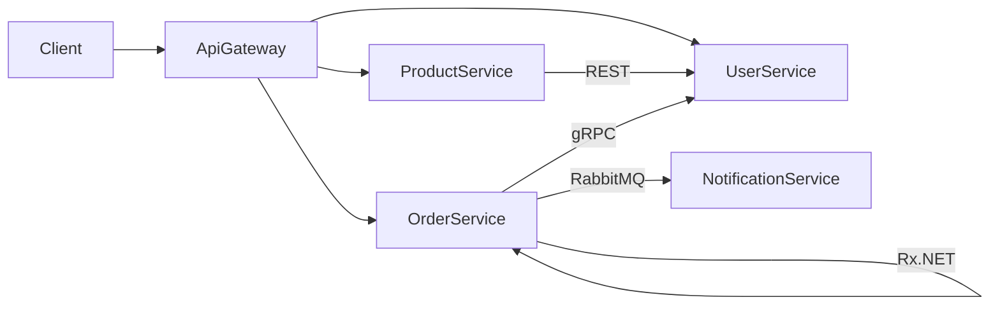

# 🏗️ DevOps Mikroservisni Projekat

## 📌 Opis projekta

Mikroservisna aplikacija razvijena u **.NET 8**, koja demonstrira celokupan DevOps workflow: od razvoja, testiranja, CI/CD pipeline-a, Docker kontejnerizacije, do monitoringa i observability rešenja.

## 🏛️ Arhitektura

Sistem se sastoji od **5 mikroservisa** i **API Gateway-a**:

| Servis | Opis | Port |
|--------|------|------|
| `ApiGateway` | YARP reverse proxy, ulazna tačka sistema | 5000 |
| `UserService` | Upravljanje korisnicima (CRUD) | 5001 |
| `ProductService` | Upravljanje proizvodima (CRUD) | 5002 |
| `OrderService` | Upravljanje narudžbinama | 5003 |
| `NotificationService` | Slanje notifikacija (RabbitMQ consumer) | 5004 |

### Komunikacioni obrasci



- **REST API** — ProductService ↔ UserService
- **Message Queue (RabbitMQ)** — OrderService → NotificationService
- **Reaktivna komunikacija (Rx.NET)** — unutar OrderService
- **gRPC** — OrderService → UserService

## 🚀 Pokretanje projekta

```bash
# Klonirajte repozitorijum
git clone <repo-url>
cd DevOpsProject

# Pokrenite sve servise
docker compose up --build
```

## 📡 Dostupni endpointi

| Servis | Endpoint | Opis |
|--------|----------|------|
| API Gateway | `http://localhost:5000` | Ulazna tačka |
| UserService | `http://localhost:5001/api/users` | CRUD korisnika |
| ProductService | `http://localhost:5002/api/products` | CRUD proizvoda |
| OrderService | `http://localhost:5003/api/orders` | CRUD narudžbina |
| Health checks | `http://localhost:500X/health` | Svi servisi |
| Metrics | `http://localhost:500X/metrics` | Prometheus metrike |

## 📊 Monitoring alati

| Alat | URL | Credentials |
|------|-----|-------------|
| Grafana | `http://localhost:3000` | admin / admin |
| Prometheus | `http://localhost:9090` | — |
| Jaeger (Tracing) | `http://localhost:16686` | — |
| Seq (Logovi) | `http://localhost:8081` | — |
| RabbitMQ Management | `http://localhost:15672` | devops / devops123 |

## 🧪 Pokretanje testova

```bash
dotnet test DevOpsProject.sln
```

## 🔄 CI/CD Pipeline

### CI (`.github/workflows/ci.yml`)

Pokreće se na **svaki push** i **PR** ka `main`/`dev`:

| Job | Opis |
|-----|------|
| **build-and-test** | Restore → Build (Release) → Unit testovi (3 projekta) → Upload `.trx` rezultata |
| **code-quality** | .NET Analyzers sa `TreatWarningsAsErrors=true` |
| **docker-build** | Matrix build svih 5 Docker image-a |

### CD (`.github/workflows/cd.yml`)

Pokreće se na **push na `main`** (nakon merge-a):

| Job | Opis |
|-----|------|
| **build-and-push** | Build → Push na GHCR (`ghcr.io`) sa SHA + `latest` tagovima |
| **deploy** | Placeholder za deployment (spreman za proširenje) |

## 🧰 Tehnologije

| Kategorija | Tehnologija |
|-----------|-------------|
| **Runtime** | .NET 8, ASP.NET Core |
| **Baza podataka** | PostgreSQL 16 (EF Core) |
| **Message Broker** | RabbitMQ 3.13 |
| **API Gateway** | YARP (Yet Another Reverse Proxy) |
| **gRPC** | Grpc.AspNetCore / Grpc.Net.Client |
| **Reactive** | Rx.NET (System.Reactive) |
| **Tracing** | OpenTelemetry → Jaeger |
| **Metrics** | OpenTelemetry → Prometheus → Grafana |
| **Logging** | Serilog → Seq |
| **Testiranje** | xUnit, Moq, FluentAssertions, EF Core InMemory |
| **Kontejnerizacija** | Docker, Docker Compose |
| **CI/CD** | GitHub Actions |
| **Registry** | GitHub Container Registry (GHCR) |

## 📁 Struktura projekta

```
/
├── src/
│   ├── ApiGateway/
│   ├── UserService/
│   ├── ProductService/
│   ├── OrderService/
│   └── NotificationService/
├── tests/
│   ├── UserService.Tests/
│   ├── ProductService.Tests/
│   ├── OrderService.Tests/
│   └── E2E.Tests/
├── monitoring/
│   ├── prometheus/
│   │   └── prometheus.yml
│   └── grafana/
│       ├── provisioning/
│       │   ├── datasources/
│       │   └── dashboards/
│       └── dashboards/
│           └── microservices.json
├── .github/workflows/
│   ├── ci.yml
│   └── cd.yml
├── docker-compose.yml
├── DevOpsProject.sln
├── .editorconfig
└── README.md
```